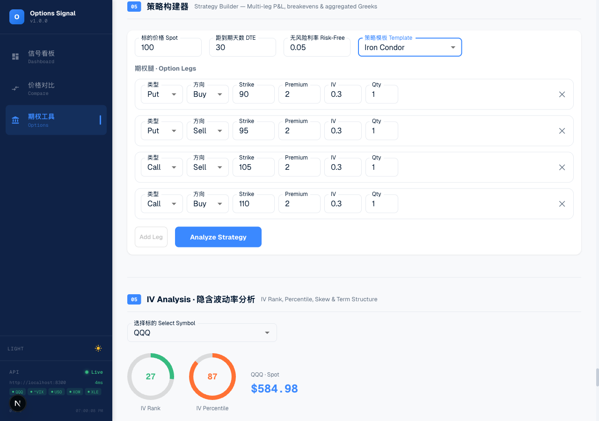
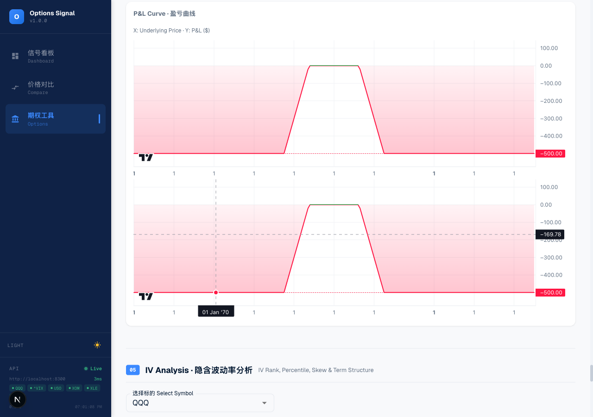

<div align="center">

# 📈 Options Signal System

[](https://github.com/jeremygu000/otpions-signal-system/actions/workflows/ci.yml)
[](https://www.python.org/downloads/)
[](LICENSE)
[](https://github.com/psf/black)
[](https://mypy-lang.org/)

Full-stack options trading signal & analysis platform. Evaluates market regime (QQQ + VIX), generates directional signals, and provides a comprehensive options analysis toolkit — Greeks calculator, IV analysis, multi-leg strategy builder, backtesting with AI interpretation, and position management with portfolio analytics. **Signal system only — no auto-execution.**

</div>

## Features

### Signal Engine

- **Market regime detection** — Classifies environment as `risk_on`, `neutral`, or `risk_off` using QQQ trend + VIX levels
- **Per-symbol strategies** — Bearish setups (USO, XOM, XLE) and bullish setups (CRM) with transparent scoring
- **Signal levels** — Strong / Watch / No signal, with full rationale and options structure suggestions
- **Multi-channel notifications** — Telegram bot + WeChat Work webhook, silently disabled when unconfigured
- **CLI + loop mode** — One-shot or polling with configurable intervals, market hours filter

### Options Analysis Toolkit

- **Options chain browser** — Real-time chain data with per-contract Greeks (delta, gamma, theta, vega, rho)
- **Greeks calculator** — Black-Scholes pricing engine with interactive parameter inputs
- **IV analysis** — IV rank, percentile, skew curve, term structure, historical volatility comparison (5/10/20/60-day)
- **Multi-leg strategy builder** — Build & analyze spreads, straddles, strangles, iron condors, iron butterflies with P&L curves
- **Backtesting** — Historical strategy backtesting with equity curves and trade logs
- **AI backtest interpretation** — Ollama-powered streaming analysis of backtest results

### ML Enhancement

- **Signal scoring model** — LightGBM classifier with calibrated probabilities, combined score blending rule-based + ML signals
- **Regime classification** — 3-state Hidden Markov Model (HMM) on QQQ + VIX features for market regime detection
- **Feature engineering** — 30+ technical features (multi-horizon returns, volatility measures, RSI, MACD, OBV, etc.) with shift(1) to prevent look-ahead bias
- **Training pipeline** — One-click model training via API with TimeSeriesSplit cross-validation, model persistence (joblib), and status tracking
- **LLM-powered analysis** — Ollama streaming analysis of individual signals enriched with ML confidence and feature importance
- **Dashboard integration** — Training controls, ML regime with probability bars, enhanced signal cards with confidence scores and feature importance

### Position Management

- **Full CRUD** — Add, edit, close, and delete option positions with strategy tagging
- **Portfolio summary** — Total cost, unrealized/realized P&L, position counts by status
- **Aggregated Greeks** — Real-time portfolio-level delta, gamma, theta, vega, rho
- **Strategy grouping** — Group positions by strategy name with per-group P&L analytics
- **Expiration alerts** — Highlight positions expiring within configurable days window
- **SQLite storage** — Async SQLAlchemy ORM with PostgreSQL-ready schema

### Web Dashboard

- **6 pages** — Dashboard, Signal Detail, Symbol Detail, Comparison, Options Tools, Position Management
- **Dark/light theme** — System-aware with manual toggle
- **Real-time charts** — TradingView lightweight-charts for candlestick, P&L, IV skew, term structure

## Screenshots

|                  Dashboard                   |                    Options Tools                     |
| :------------------------------------------: | :--------------------------------------------------: |
|  |  |

|                                Strategy Builder                                |                            P&L Chart                             |
| :----------------------------------------------------------------------------: | :--------------------------------------------------------------: |
|  |  |

## Project Structure

```
options-signal-system/
  app/
    config.py             # Pydantic Settings — env vars + .env file
    models.py             # All Pydantic models (signals, options, Greeks, IV, multi-leg)
    data_provider.py      # Daily data from Parquet store, intraday from yfinance
    indicators.py         # SMA, ATR, VWAP, rolling high/low, prev day high/low
    market_regime.py      # MarketRegimeEngine — QQQ/VIX rule-based scoring
    strategy_engine.py    # StrategyEngine — per-symbol directional scoring
    greeks.py             # Black-Scholes pricing & Greeks engine
    options_data.py       # yfinance options chain fetcher with BS Greeks
    synthetic_options.py  # Synthetic historical options chain generator
    iv_analysis.py        # IV rank, percentile, skew, term structure, HV
    multi_leg.py          # Multi-leg strategy analyzer (P&L, breakevens, Greeks)
    ml/
      features.py         # 30+ technical features + binary label generation
      regime_classifier.py # 3-state HMM regime classifier (QQQ + VIX)
      signal_scorer.py    # LightGBM signal scorer with calibrated probabilities
      pipeline.py         # Training pipeline orchestration + status tracking
      llm_analyzer.py     # Ollama-powered streaming signal analysis
    database.py           # Async SQLAlchemy engine, session factory, init/close
    position_models.py    # SQLAlchemy ORM model (Position table)
    positions.py          # Position CRUD, P&L calc, Greeks aggregation, alerts
    report.py             # Chinese-language console + notification report builder
    notifier.py           # Telegram + WeChat + CompositeNotifier
    server.py             # FastAPI REST API (port 8400, 31 endpoints)
    main.py               # CLI entry point
    utils.py              # Timezone helpers, market hours check, logging
  tests/                  # 248 tests (pytest)
  web/                    # Next.js dashboard (see Web Dashboard section)
  .github/workflows/      # CI + Release pipelines
  Dockerfile              # Backend container (Python 3.12 slim + uv)
  docker-compose.yml      # Full stack: api + web services
  pyproject.toml
  .env.example
```

## Prerequisites

- Python 3.12+
- [uv](https://docs.astral.sh/uv/) (recommended) or pip
- [yahoo-finance-data](https://github.com/jeremygu000/yahoo-finance-data) package installed and Parquet data populated at `~/.market_data/parquet/`
- Node.js 22+ (for web dashboard)
- Ollama (optional, for AI backtest interpretation and ML signal analysis)
- libomp (macOS only, for LightGBM: `brew install libomp`)

## Installation

```bash
# Clone and enter project
cd options-signal-system

# Install Python dependencies with uv
uv sync

# Or with pip
pip install -r requirements.txt

# Copy and edit environment file
cp .env.example .env
```

## Running

### CLI — One-shot scan

```bash
python -m app.main                              # Run once (market hours only)
python -m app.main --always-run                 # Run once (ignore market hours)
```

### CLI — Loop mode

```bash
python -m app.main --loop                       # Poll every 600s (default)
python -m app.main --loop --every-seconds 300   # Poll every 5 minutes
python -m app.main --loop --always-run          # Poll outside market hours too
```

### REST API server

```bash
uvicorn app.server:app --host 0.0.0.0 --port 8400 --reload
```

### Web dashboard

```bash
cd web
npm install
npm run dev     # Starts on http://localhost:3100
```

Make sure the FastAPI server is running on port 8400 before starting the dashboard.

## Environment Variables

| Variable             | Default                  | Description                                 |
| -------------------- | ------------------------ | ------------------------------------------- |
| `TELEGRAM_BOT_TOKEN` | _(empty)_                | Telegram bot API token (optional)           |
| `TELEGRAM_CHAT_ID`   | _(empty)_                | Telegram chat/group ID (optional)           |
| `WECHAT_WEBHOOK_URL` | _(empty)_                | WeChat Work robot webhook URL (optional)    |
| `POLL_INTERVAL`      | `600`                    | Polling interval in seconds                 |
| `SYMBOLS`            | `USO,XOM,XLE,CRM`        | Comma-separated symbols to evaluate         |
| `STRONG_ONLY`        | `false`                  | Only send notifications for strong signals  |
| `OLLAMA_BASE_URL`    | `http://localhost:11434` | Ollama API base URL (for AI interpretation) |
| `OLLAMA_MODEL`       | `qwen3:32b`              | Ollama model name                           |

Notifications and AI features are silently disabled when tokens/URLs are not configured — no errors.

## REST API Endpoints

All endpoints are available at `/api/v1/...` (canonical) and `/api/...` (legacy alias).

| Endpoint                                  | Method | Description                                            |
| ----------------------------------------- | ------ | ------------------------------------------------------ |
| `/api/v1/health`                          | GET    | Health check                                           |
| `/api/v1/symbols`                         | GET    | List configured symbols with data availability         |
| `/api/v1/regime`                          | GET    | Current market regime evaluation                       |
| `/api/v1/signals`                         | GET    | Evaluate all symbols                                   |
| `/api/v1/scan`                            | GET    | Full scan — regime + all signals (main dashboard)      |
| `/api/v1/indicators/{symbol}`             | GET    | Technical indicators snapshot                          |
| `/api/v1/ohlcv/{symbol}?days=90`          | GET    | OHLCV candlestick data with pagination                 |
| `/api/v1/compare?tickers=QQQ,USO&days=90` | GET    | Normalized price comparison                            |
| `/api/v1/options/expirations/{symbol}`    | GET    | Available expiration dates                             |
| `/api/v1/options/chain/{symbol}`          | GET    | Options chain summary (calls + puts)                   |
| `/api/v1/options/chain/{symbol}/detail`   | GET    | Full chain with per-contract Greeks                    |
| `/api/v1/greeks/calculate`                | POST   | Black-Scholes Greeks calculator                        |
| `/api/v1/iv/analysis/{symbol}`            | GET    | IV rank, percentile, skew, term structure, HV          |
| `/api/v1/options/multi-leg/analyze`       | POST   | Multi-leg strategy P&L, breakevens, aggregated Greeks  |
| `/api/v1/backtest`                        | POST   | Run historical backtest                                |
| `/api/v1/backtest/interpret`              | POST   | AI interpretation of backtest results (SSE streaming)  |
| `/api/v1/positions`                       | POST   | Create a new option position                           |
| `/api/v1/positions`                       | GET    | List positions (filter by status, symbol, strategy)    |
| `/api/v1/positions/{id}`                  | GET    | Get single position by ID                              |
| `/api/v1/positions/{id}`                  | PUT    | Update position fields                                 |
| `/api/v1/positions/{id}/close`            | POST   | Close a position with exit price                       |
| `/api/v1/positions/{id}`                  | DELETE | Delete a position                                      |
| `/api/v1/portfolio/summary`               | GET    | Portfolio summary with aggregated Greeks               |
| `/api/v1/portfolio/strategies`            | GET    | Positions grouped by strategy with P&L totals          |
| `/api/v1/positions/alerts/expiring`       | GET    | Positions expiring within N days                       |
| `/api/v1/positions/batch/mark-expired`    | POST   | Batch-mark expired positions                           |
| `/api/v1/signals/enhanced`                | GET    | ML-enhanced signals with confidence scores & regime    |
| `/api/v1/ml/regime`                       | GET    | ML regime prediction (HMM) with state probabilities    |
| `/api/v1/ml/train`                        | POST   | Trigger ML training pipeline (regime + signal scorer)  |
| `/api/v1/ml/status`                       | GET    | Training status and model availability                 |
| `/api/v1/ml/analyze/{symbol}`             | POST   | LLM streaming analysis of signal with ML context (SSE) |

## Strategy Overview

### Market Regime

The system first evaluates the broad market environment using QQQ and VIX:

| Condition                        | Effect     |
| -------------------------------- | ---------- |
| QQQ 3-day consecutive up closes  | +1 risk_on |
| QQQ above 5-day SMA              | +1 risk_on |
| QQQ broke above last week's high | +1 risk_on |
| VIX below 20                     | +1 risk_on |
| VIX below last week's low        | +1 risk_on |

Opposite conditions score toward risk_off. **Score >= 3 → risk_on**, **score <= -3 → risk_off**, otherwise neutral.

### Symbol Strategies

**Bearish setups (USO, XOM, XLE)** — "Sell the rip"

- Scores based on: proximity to yesterday's high, SMA5/10 death cross, position in 20-day range, VWAP rejection, regime alignment
- Suggested structures: Bear Call Spread, Put Debit Spread

**Bullish setups (CRM)** — "Buy the dip"

- Scores based on: proximity to support (yesterday's low, SMA, 20-day low), VWAP reclaim, price stabilization, regime alignment
- Suggested structures: Bull Call Spread, Call Debit Spread

**Signal thresholds**: Score >= 5 → Strong signal, Score >= 3 → Watch signal, otherwise No signal.

### Sample Output

```
════════════════════════════════════════════
  期权信号系统 — 扫描报告
  2025-04-04 10:30:15 (America/New_York)
════════════════════════════════════════════

▌ 市场环境: NEUTRAL
  QQQ: 478.23  |  VIX: 18.45
  · QQQ 连续3日收阳
  · QQQ 站上5日均线
  · VIX 位于上周低点之上

────────────────────────────────────────────

[强信号] USO | 逢高做空 | 考虑建立熊市价差
  现价: 78.23  |  触发位: 78.10
  建议结构: Bear Call Spread
  执行提示: 可优先观察靠近昨日高点的卖出腿
  原因:
  · 大盘环境为 neutral，允许偏空
  · 当前价格接近昨日高点和5日均线
  · 盘中跌回 VWAP 下方
  · 价格位于近20日高位区域

[观察信号] CRM | 逢低做多 | 关注支撑位企稳
  现价: 265.10  |  触发位: 264.80
  建议结构: Bull Call Spread
  执行提示: 等待价格重新站上 VWAP 后确认
  原因:
  · 价格接近5日均线支撑
  · 盘中回踩后企稳

════════════════════════════════════════════
```

## Web Dashboard

The web dashboard is a Next.js application at `web/` providing real-time visualization and interactive analysis tools:

| Page / Section      | Route         | Description                                                                                 |
| ------------------- | ------------- | ------------------------------------------------------------------------------------------- |
| Dashboard           | `/`           | Market regime, ML regime (HMM), enhanced signal cards with ML confidence, training controls |
| Signal Detail       | `/`           | Expanded signal view with technical indicators & options suggestions                        |
| Symbol Detail       | `/symbol/[s]` | Full-page candlestick + volume charts, indicator overlays                                   |
| Price Comparison    | `/compare`    | Normalized multi-line comparison of selected symbols                                        |
| Options Tools       | `/options`    | All options analysis tools (see below)                                                      |
| Position Management | `/positions`  | Portfolio summary, Greeks, positions CRUD table, strategy groups, alerts                    |

### Options Tools Page (`/options`)

| Section           | Description                                                                            |
| ----------------- | -------------------------------------------------------------------------------------- |
| Options Chain     | Live chain with sortable table, per-contract Greeks, calls/puts toggle                 |
| Greeks Calculator | Interactive BS calculator — input spot/strike/DTE/IV/rate, see all Greeks              |
| Strategy Builder  | Template selector (7 strategies), leg editor, P&L chart, breakevens, aggregated Greeks |
| IV Analysis       | IV rank/percentile gauges, skew curve chart, term structure chart, HV comparison       |
| Backtesting       | Strategy backtesting with equity curve, trade log, AI-powered interpretation           |

**Tech stack**: Next.js (App Router), React 19, MUI 7, lightweight-charts 5, TypeScript.

**Dev tooling**: tsgo (typecheck), oxlint (lint), prettier (format).

```bash
cd web
npm run dev           # Development server (port 3100)
npm run build         # Production build
npm run typecheck     # Type checking (tsgo)
npm run lint          # Linting (oxlint)
npm run format        # Format (prettier)
npm run format:check  # Check formatting
```

## Development

### Python tooling

```bash
uv run pytest                    # Run tests
uv run black app/ tests/         # Format
uv run mypy app/                 # Type check
```

### Code quality

| Tool     | Command                       | Scope                              |
| -------- | ----------------------------- | ---------------------------------- |
| pytest   | `uv run pytest`               | Unit tests (248 tests)             |
| black    | `uv run black app/ tests/`    | Code formatting                    |
| mypy     | `uv run mypy app/`            | Static type checking (strict mode) |
| tsgo     | `npm run typecheck` (in web/) | TypeScript type checking           |
| oxlint   | `npm run lint` (in web/)      | Fast JavaScript/TypeScript linting |
| prettier | `npm run format` (in web/)    | Code formatting                    |

## Docker

```bash
# Build and run full stack
docker compose up --build

# Or build individually
docker build -t options-signal-api .                    # Backend
docker build -t options-signal-web -f web/Dockerfile .  # Frontend
```

The `docker-compose.yml` runs both services:

- **api** (port 8400) — FastAPI backend
- **web** (port 3100) — Next.js frontend (standalone mode)

Environment variables are loaded from `.env` (optional — services start with defaults if not present).

## CI/CD

GitHub Actions workflows in `.github/workflows/`:

- **ci.yml** — Runs on push/PR: Python lint + type check + tests (matrix: 3.12, 3.13), frontend lint + type check + build, Docker build verification
- **release.yml** — Runs on version tags (`v*`): full checks → builds & pushes Docker images to GHCR → creates GitHub Release with auto-generated changelog

## Data Source

Daily OHLCV data is read from `~/.market_data/parquet/` (shared with the [yahoo-finance-data](https://github.com/jeremygu000/yahoo-finance-data) project). Intraday data (15-minute bars) is fetched live from Yahoo Finance via `yfinance`.

Required tickers in the Parquet store: `QQQ`, `VIX` (stored as `VIX.parquet` from `^VIX`), `USO`, `XOM`, `XLE`, `CRM`.

## Important Notes

- This is a **signal system only** — no auto-execution, no order placement
- Options chain data comes from Yahoo Finance via yfinance — Greeks are calculated using Black-Scholes
- Daily data depends on the Parquet store being populated (run yahoo-finance-data's data update first)
- Intraday data requires market hours for meaningful VWAP calculations
- AI backtest interpretation requires a running Ollama instance (optional feature)
- ML models (regime classifier, signal scorer) must be trained via `/api/v1/ml/train` before ML-enhanced features activate — system gracefully falls back to rule-based scoring when models are unavailable
- Scoring thresholds and rules are configurable — edit `strategy_engine.py` to tune

## Future Extensions

- **IBKR integration** — Connect to Interactive Brokers for live options chain data and real strike selection
- **Additional symbols** — Add more ETFs, stocks, or sector-specific strategies
- **Scheduled execution** — launchd/systemd/cron for automated periodic scanning
