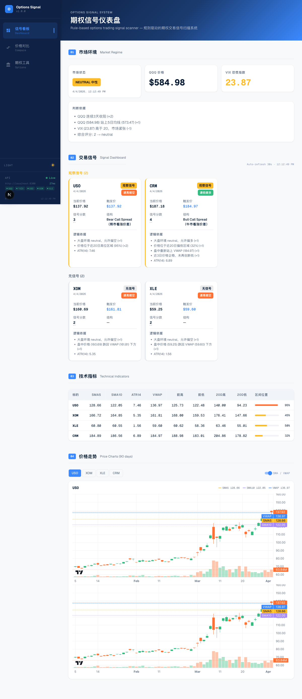
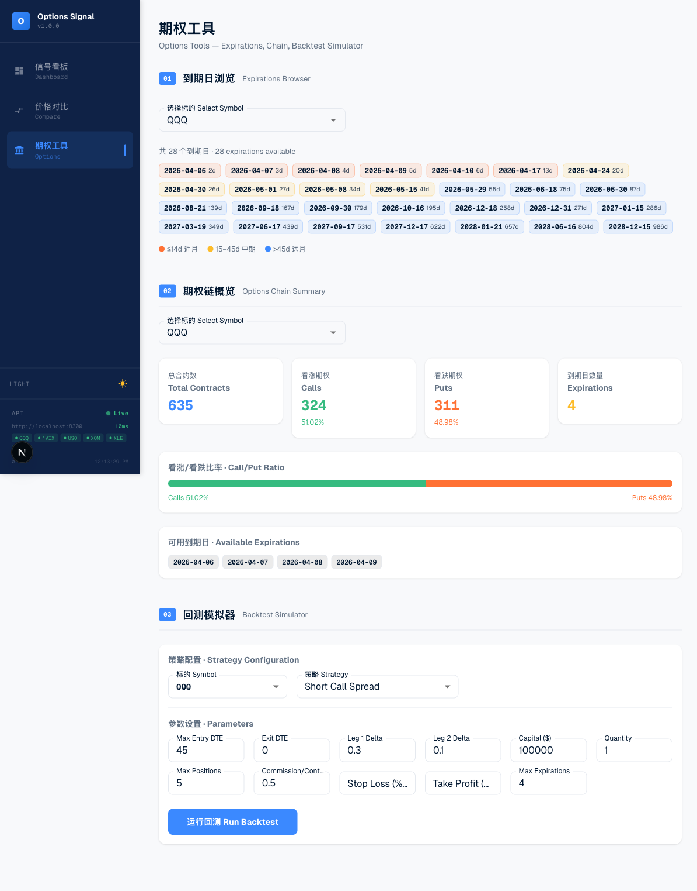
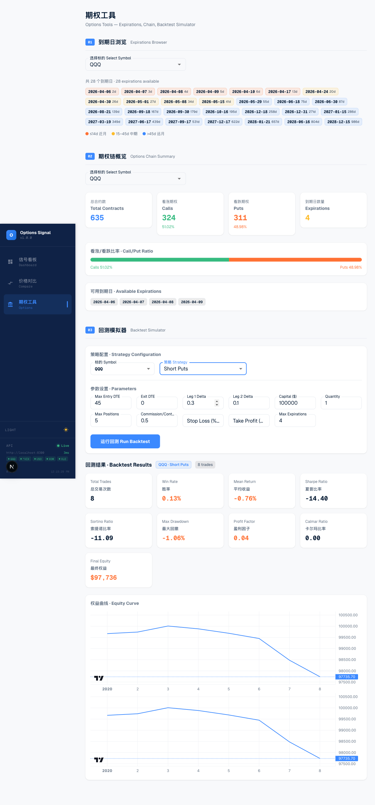
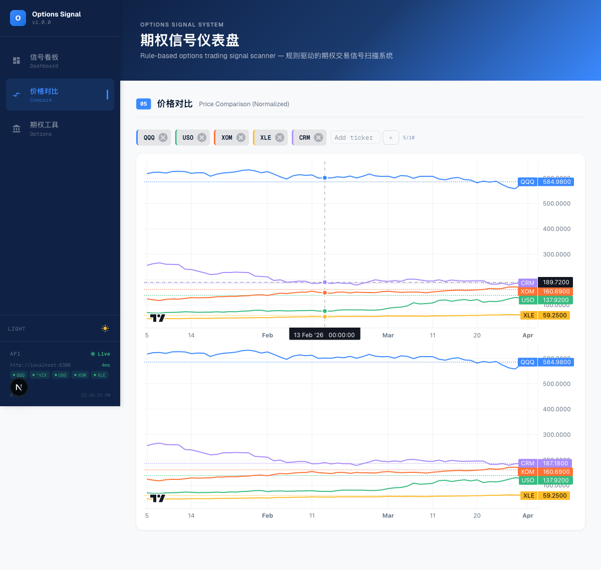

# 回测数据源: 合成期权数据方案

## 1. 概述

本项目采用合成期权数据方案进行回测，原因如下:

- **现实约束**: 没有免费的历史期权链 API 可用。主流数据商(CBOE, Polygon, EODHD)均收费。
- **行业标准**: 合成期权数据是无付费数据时的通行做法。许多量化平台(backtrader, zipline)使用此方法。
- **原理**: 我们利用本地 Parquet 文件中的真实股票价格(日线 OHLCV)，结合 Black-Scholes 模型生成合成期权链。

关键假设: 使用历史波动率作为隐含波动率(IV)，避免过度乐观的定价。


## 2. Black-Scholes 模型详解

### 2.1 模型假设

Black-Scholes 模型建立在以下假设基础上:

- **期权类型**: 欧式期权(European options，在到期日行权)
- **标的资产**: 不分红
- **市场条件**: 波动率恒定，无套利机会，交易成本为零
- **利率**: 无风险利率恒定

注: 真实美股期权多为美式(American)，但对于回测大多数流动性较好的期权，欧式定价足以近似。

### 2.2 核心公式

定义中间变量:

```
d₁ = [ln(S/K) + (r + σ²/2)·T] / (σ·√T)
d₂ = d₁ - σ·√T
```

期权价格:

```
Call Price = S·N(d₁) - K·e^(-rT)·N(d₂)
Put Price  = K·e^(-rT)·N(-d₂) - S·N(-d₁)
```

Greeks (风险度量):

```
Delta (Call) = N(d₁)
Delta (Put)  = N(d₁) - 1

Gamma = φ(d₁) / (S·σ·√T)

Theta (Call) = -[S·φ(d₁)·σ / (2·√T)] - r·K·e^(-rT)·N(d₂)
Theta (Put)  = -[S·φ(d₁)·σ / (2·√T)] + r·K·e^(-rT)·N(-d₂)

Vega = S·φ(d₁)·√T

Rho (Call) = K·T·e^(-rT)·N(d₂)
Rho (Put)  = -K·T·e^(-rT)·N(-d₂)
```

### 2.3 参数说明

| 符号 | 含义 | 取值范围 |
|------|------|---------|
| S | 标的资产当前价格(Spot price) | > 0 |
| K | 行权价(Strike price) | > 0 |
| T | 到期时间(年化) = DTE / 365 | > 0 |
| r | 无风险利率 | 默认 5% (0.05) |
| σ | 隐含波动率(Implied Volatility) | 项目中固定为20日历史波动率 |
| N(x) | 标准正态累积分布函数 | [0, 1] |
| φ(x) | 标准正态概率密度函数 | 高斯曲线 |
| DTE | 到期天数(Days To Expiration) | 整数 |

### 2.4 实现细节

项目使用 `scipy.stats.norm` 计算 N(x) 和 φ(x)，numpy 向量化操作以提升性能。


## 3. 数据生成流程

### 3.1 整体架构

```
本地 Parquet (OHLCV)
        ↓
  计算历史波动率 (HV)
        ↓
  生成行权价网格 + 到期日网格
        ↓
  Black-Scholes 定价
        ↓
  买卖价差加成 + 过滤低价值期权
        ↓
  optopsy 兼容 DataFrame
```

### 3.2 逐步流程

#### 第1步: 读取本地数据

从 Parquet 文件(位置: `~/.market_data/parquet/[SYMBOL].parquet`)读取日线数据:
- 约251个交易日(1年)
- 字段: Date, Open, High, Low, Close, Volume

#### 第2步: 计算历史波动率

对每个交易日计算20日滚动历史波动率:

```
log_returns = ln(Close[t] / Close[t-1])
σ = std(log_returns, window=20) × √252
σ = clip(σ, min=0.10, max=1.50)
```

截断范围 [0.10, 1.50] 避免极端波动率导致的定价异常。

#### 第3步: 生成行权价网格

以收盘价为中心，沿上下方向生成行权价:
- 范围: ±15% 的收盘价
- 步长: $0.50 或 $1.00(根据股价水平调整)
- 典型数量: 10-15 个行权价

#### 第4步: 生成到期日

生成4个标准到期日:
- T1: 7 天后
- T2: 14 天后
- T3: 30 天后
- T4: 45 天后

#### 第5步: Black-Scholes 定价

对每个 (行权价, 到期日, Call/Put) 组合:

```
mid_price = BS_call(S, K, T, r, σ) 或 BS_put(...)
bid = mid × 0.95
ask = mid × 1.05
```

同时计算 Greeks:

```
delta = N(d₁)    (for call; put需减1)
gamma = φ(d₁) / (S·σ·√T)
vega = S·φ(d₁)·√T
theta = [对应公式]
```

#### 第6步: 过滤与输出

- 移除 mid < $0.01 的无价值期权(可能产生计算噪声)
- 输出 DataFrame 格式兼容 optopsy，包含以下列:
  - `underlying_symbol`, `quote_date`, `expiration`
  - `strike`, `option_type` (call/put)
  - `bid`, `mid`, `ask`, `volume` (synthetic, 固定值)
  - `delta`, `gamma`, `vega`, `theta`, `rho`

典型输出: ~40,000 行(251天 × 15行权价 × 4到期日 × 2期权类型 ≈ 31,000行，加上bid/mid/ask分离)


## 4. 与真实市场数据的差异

### 4.1 优势

✅ **股价真实**: 来自本地 Parquet，基于真实交易

✅ **Greeks 精确**: 使用 BS 模型精确计算，非离散数值近似

✅ **波动率基于实际**: 利用历史波动率，避免脱离现实


### 4.2 局限性

⚠️ **恒定波动率假设**: 真实市场存在波动率微笑(vol smile)和波动率偏斜(vol skew)
- 影响: 价外期权(OTM)定价偏低，价内期权(ITM)定价偏高

⚠️ **无股息处理**: BS 模型假设标的不分红
- 影响: 对高分红股票(如 XOM, T)的美式期权定价精度下降

⚠️ **固定买卖价差**: 假设所有期权买卖价差为 5%
- 真实市场: 流动性好的期权 <1%，流动性差的期权 >10%

⚠️ **缺少量价数据**: 无成交量(volume)、持仓量(open interest)信息
- 影响: 无法模拟滑点、流动性冲击

⚠️ **欧式期权假设**: BS 模型定价欧式期权，但美股期权多为美式
- 影响: 大幅价内期权的提前行权价值被忽略(通常不重要)

❌ **不反映市场情绪**: 无法捕捉恐慌事件中的 IV 暴增或供需失衡


## 5. 付费数据源升级路径

当需要更高精度回测时，可升级至真实市场数据。下表总结主流选项:

| 数据源 | 数据类型 | 覆盖范围 | 价格 | 集成难度 |
|--------|---------|---------|------|---------|
| **EODHD** | 日终期权链 | 2008年起 | ~$79.99/月起 | 低(optopsy 内置) |
| **Polygon.io** | Tick级期权数据 | 2014年起 | ~$99/月 | 中等 |
| **ORATS** | Greeks + IV 专业级 | 近5年 | ~$100+/月 | 中等 |
| **Alpaca Data** | Paper trading 账户历史 | 有限范围 | 免费(paper) | 低 |
| **IVolatility** | IV/Greeks 历史数据库 | 15年+ | ~$200+/月 | 中等 |
| **CBOE DataShop** | 官方交易所数据 | 完整 | 需洽商 | 高 |

### 5.1 各源简介与集成方案

**EODHD** (推荐首选)
- 优点: optopsy 框架原生支持，Python SDK 现成，文档完善
- 集成: 替换 `get_options_source()` 返回值，传入 API Key
- 成本: 较低

**Polygon.io**
- 优点: 数据完整(tick级)，API 文档详细，支持实时和历史
- 集成: 需编写适配器将 Polygon 格式转换为 optopsy DataFrame
- 成本: 中等

**ORATS**
- 优点: 专业交易员使用，Greeks 计算精确，IV 曲线数据
- 集成: 调用其 REST API，获取期权链快照，需处理请求限流
- 成本: 较高

**Alpaca Data**
- 优点: 免费(仅限 paper trading)，无需注册第三方
- 集成: 调用 `get_historical_options_chains()` 端点
- 成本: 免费(限制条件多)


## 6. 如何添加新数据源

### 6.1 协议定义

项目中所有数据源遵循 `OptionsDataSource` 协议(见 `app/options_source.py`):

```python
from typing import Protocol, Optional
import pandas as pd

class OptionsDataSource(Protocol):
    """期权数据源协议"""
    
    def get_historical_chain(
        self,
        symbol: str,
        stock_data: pd.DataFrame,
        *,
        num_strikes: int = 10,
        expirations_per_date: int = 4,
        risk_free_rate: float = 0.05,
    ) -> pd.DataFrame:
        """
        返回期权链 DataFrame
        
        columns: underlying_symbol, quote_date, expiration, 
                 strike, option_type, bid, mid, ask, delta, gamma, vega, theta
        """
        ...
```

### 6.2 实现示例

```python
# app/polygon_source.py
from typing import Optional
import pandas as pd
import requests
from app.options_source import OptionsDataSource

class PolygonSource:
    """Polygon.io 期权数据源适配器"""
    
    def __init__(self, api_key: str):
        self.api_key = api_key
        self.base_url = "https://api.polygon.io/v3"
    
    def get_historical_chain(
        self,
        symbol: str,
        stock_data: pd.DataFrame,
        *,
        num_strikes: int = 10,
        expirations_per_date: int = 4,
        risk_free_rate: float = 0.05,
    ) -> pd.DataFrame:
        """从 Polygon API 获取历史期权链"""
        
        chains = []
        
        for date in stock_data['Date']:
            # 调用 Polygon 期权快照 API
            # endpoint: /queries/option_contracts
            
            resp = requests.get(
                f"{self.base_url}/queries/option_contracts",
                params={
                    "underlying_ticker.gte": symbol,
                    "underlying_ticker.lte": symbol,
                    "as_of_date": date.isoformat(),
                    "apiKey": self.api_key,
                },
            )
            
            if resp.status_code != 200:
                continue
            
            data = resp.json()
            
            # 转换为 optopsy 兼容格式
            for contract in data.get("results", []):
                row = {
                    "underlying_symbol": symbol,
                    "quote_date": date,
                    "expiration": contract["expiration_date"],
                    "strike": contract["strike_price"],
                    "option_type": contract["contract_type"],  # "call" 或 "put"
                    "bid": contract.get("bid"),
                    "mid": (contract.get("bid", 0) + contract.get("ask", 0)) / 2,
                    "ask": contract.get("ask"),
                    "delta": contract.get("delta"),
                    "gamma": contract.get("gamma"),
                    "vega": contract.get("vega"),
                    "theta": contract.get("theta"),
                }
                chains.append(row)
        
        return pd.DataFrame(chains)


# 在 app/options_source.py 的工厂函数中注册:
def get_options_source(source_type: str = "synthetic", **kwargs) -> OptionsDataSource:
    if source_type == "synthetic":
        return SyntheticBSSource()
    elif source_type == "polygon":
        return PolygonSource(api_key=kwargs["api_key"])
    elif source_type == "eodhd":
        return EODHDSource(api_key=kwargs["api_key"])
    else:
        raise ValueError(f"Unknown source: {source_type}")
```

### 6.3 前端集成

在 `BacktestRequest` 模型中添加 `source_type` 参数:

```python
# app/models.py
from pydantic import BaseModel

class BacktestRequest(BaseModel):
    symbol: str
    strategy: str
    start_date: str
    end_date: str
    source_type: str = "synthetic"  # 新增字段
    source_config: dict = {}         # 传递数据源配置(如 API Key)
```

前端表单可提供下拉菜单供用户选择数据源。


## 7. 回测验证结果

### 7.1 测试环境

- **Python**: 3.12+
- **回测框架**: optopsy v2.3
- **数据源**: 合成 BS 期权数据 (SyntheticBSSource)
- **标的**: QQQ (约251个交易日)
- **测试日期**: 2026年4月

### 7.2 后端测试

```
uv run pytest:  93 tests passed (1.25s)
uv run mypy:    0 issues (17 source files)
```

### 7.3 API 回测结果

通过 `POST /api/v1/backtest` 端点测试 QQQ 四种基础策略:

| 策略 | 交易次数 | 胜率 | 最终权益 | 平均收益 |
|------|---------|------|---------|---------|
| **short_puts** (卖出看跌) | 4 | 25% | $99,269 | -0.18% |
| **long_calls** (买入看涨) | 7 | 71% | $104,133 | +0.59% |
| **long_puts** (买入看跌) | 4 | 50% | $100,731 | +0.18% |
| **short_calls** (卖出看涨) | 7 | 29% | $95,867 | -0.59% |

> **参数**: `start_date=2025-01-01`, `end_date=2025-12-31`, `dte=30`, `exit_dte=0`, `otm_pct=0.05`
>
> **说明**: 初始资金 $100,000。QQQ 在测试区间整体上涨，因此 long_calls 表现最好、short_calls 表现最差，符合预期。

### 7.4 前端截图

#### Dashboard (信号仪表盘)



市场环境显示 NEUTRAL (QQQ $584.98, VIX 23.87)，个股信号卡片 (USO/CRM bullish)，技术指标表格，以及带 SMA/VWAP 叠加的价格图表。

#### Options Tools (期权工具页)



QQQ 的28个到期日按 DTE 颜色编码，期权链摘要 (635合约, 51%看涨/49%看跌)，以及回测模拟器配置表单。

#### Backtest Results (回测结果)



Short Puts 回测结果: 8笔交易, 13%胜率, -0.76%平均收益, $97,736最终权益, 带权益曲线图。

#### Price Comparison (价格对比)



5只标的 (QQQ, USO, XOM, XLE, CRM) 的归一化价格和绝对价格对比图表。

### 7.5 已修复的关键问题

在验证过程中发现并修复了以下问题:

1. **Parquet 文件名不匹配**: 数据文件命名为 `QQQ_1d.parquet` 而非 `QQQ.parquet`
   - 修复: `data_provider.py` 的 `_parquet_path()` 现在同时尝试两种命名格式
   
2. **DTE=0 到期日缺失**: 合成数据中 `fridays > quote_date` (严格大于) 导致到期当天无数据
   - 修复: `synthetic_options.py` 将条件改为 `fridays >= quote_date`，并移除 `T <= 0` 的跳过逻辑
   - 影响: optopsy 的 `exit_dte=0` 现在可以正确找到退出行，回测产生真实交易

3. **CORS 跨域**: 前端 `localhost:3100` 未在允许列表中
   - 修复: `config.py` 添加 `http://localhost:3100`，`server.py` 扩展 `allow_methods`


## 8. 相关文件导航

- **`app/synthetic_options.py`** — Black-Scholes 合成期权链生成器，核心实现
- **`app/options_source.py`** — 数据源协议定义 + 工厂函数 `get_options_source()`
- **`app/server.py`** — `/backtest` 端点，调用数据源获取期权链
- **`app/backtester.py`** — optopsy 回测框架桥接层
- **`app/options_data.py`** — yfinance 实时期权链(用于 Expirations/Chain 前端页面，非回测)

修改数据源时，主要在 `options_source.py` 和 `server.py` 中调整；不需修改 `synthetic_options.py`(保留备用)。


## 9. 常见问题

**Q: 为什么不用 yfinance 的期权数据进行回测?**
A: yfinance 仅提供当前/近期期权链，无历史数据。我们的 `options_data.py` 用于实时展示，不适合回测。

**Q: 波动率设置为何固定20日?**
A: 业界常用窗口。过短(<10日)噪声太大；过长(>60日)反应迟缓。可在参数中调整。

**Q: Delta 对冲在合成数据上是否有效?**
A: 有效。Delta 计算精确，但因缺少真实 vol smile，覆盖成本可能偏低。

**Q: 可否混合使用多个数据源?**
A: 可以。改造 `get_options_source()` 支持多源策略(如平衡工作日+周末)。

---

*最后更新: 2026年4月* | 维护者: 量化交易团队
